# Lua_MT12
Main Telemetry script for the MT12  
With EdgeTX 2.11 Firmware to Flash (MT12 and receiver ER6G)  
With ESP32 S3 firmware and GERBER files   

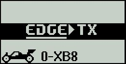       

*MAIN*

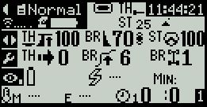    
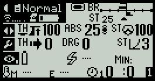  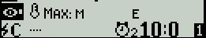      

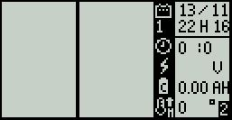  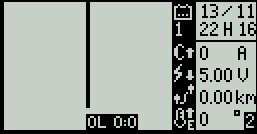      

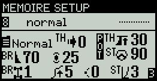         

*CONFIG*

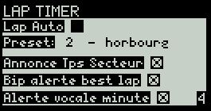  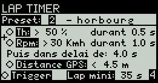  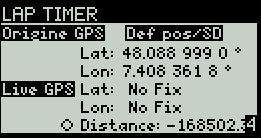   
 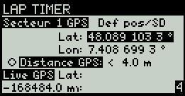     

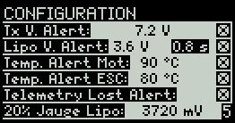  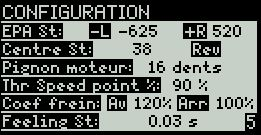  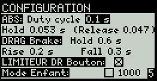   
  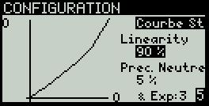  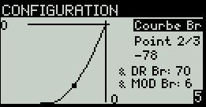   
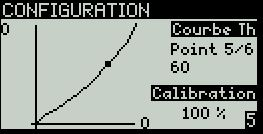  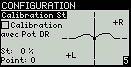        

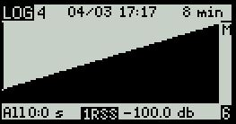  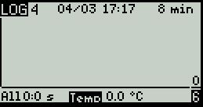        

 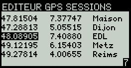     

  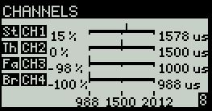      

*HELP*
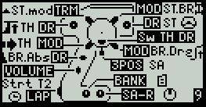 ... 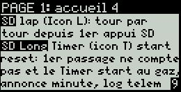 ... 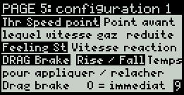      

*ESP32 S3*

 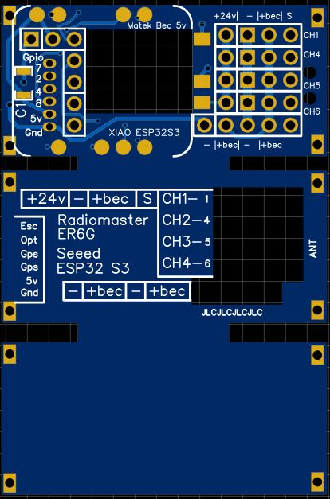 
